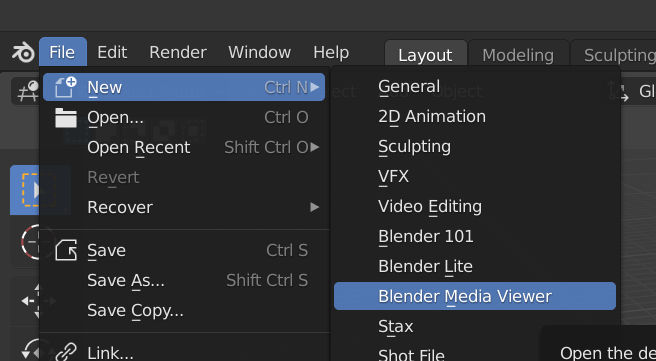

# blender-media-viewer
The blender-media-viewer is a Blender Application Template that makes Blender usable as a Video-Player, Image and Text-Viewer.
It ships with the media-viewer addon that registers many useful shortcuts and new operators.

## Table of Contents
- [Installation](#installation)
- [How to get started](#how-to-get-started)
- [Features](#features)
- [Shortcuts](#shortcuts)
- [Development](#development)

## Installation
Download or clone this repository.
In the root project folder you will find the 'blender_media_viewer' folder.
Blender expects Application Templates in these folders:

`{BLENDER_USER_SCRIPTS}/startup/bl_app_templates_user`

`{BLENDER_SYSTEM_SCRIPTS}/startup/bl_app_templates_system`

Place the `blender_media_viewer` folder in on of these directories or create a sym link to it. More information on Application Templates can be found [here](https://docs.blender.org/manual/en/latest/advanced/app_templates.html).

## How to get started
After installing blender-media-viewer you can start it via the **File->New** menu.

You can also start Blender directly with an application template with a command line argument:
`/path/to/blender --app-template blender_media_viewer`

## Features

With the **ARROW** keys, **RETURN** and **BACKSPACE** you can quickly navigate the file structure. Selecting a file will automatically place it in the media area and play it back looped. The media-viewer can display videos, single images, image sequences as well as text files. **DOT** and **COMMA** jump to the next or previous frame (wraps around frame range). **SPACE** toggles play and stop.

You can easily change your screen layout. **T** toggles the Timeline, **B** toggles the Filebrowser, **CTRL+T** toggles the Filebrowser area and with **F** you can fullscreen the media area. Note that the media-viewer remembers the last selected folders and also saves the last path when you close the application.

You can navigate the media view with your **NUMPAD**. **4,6,2,8** move the camera of the media view, **+** and **-** lets you zoom in and out. With **DOT** or **SHIFT + SPACE** you can fit the media to view.

If you toggle the sidebar of the Filebrowser with **CTRL+T** you can browse the bookmark lists with your ARROW keys while holding down **CTRL**. You can also change the Filebrowser display type with **1,2, 3**. **M** toggles mute audio.

## Shortcuts

**File Navigation**:
| Key           | Function                       |
| ------------- |--------------------------------|
| ARROWS        | Select item Filebrowser        |
| CTRL + ARROWS | Select item Filebrowser Sidebar|
| RETURN        | Jump in selected Folder        |
| BACKSPACE     | Jump one Folder up             |

**Time Navigation**:
| Key           | Function                       |
| ------------- |--------------------------------|
| SPACE         | Toggle Play                    |
| DOT           | Next frame                     |
| COMMA         | Previous frame                 |

**Areas**:
| Key           | Function                    |
| ------------- |-----------------------------|
| B             | Toggle Filebrowser          |
| T             | Toggle Timeline             |
| CTRL + T      | Toggle Filebrowser Sidebar  |
| F             | Fullscreen Media Area       |

**Screen Navigation**:
| Key           | Function                    |
| ------------- |-----------------------------|
| SPACE + SHIFT | Fit media to view           |
| NUMPAD DOT    | Fit media to view           |
| NUMPAD 4      | Move media view camera LEFT |
| NUMPAD 6      | Move media view camera RIGHT|
| NUMPAD 8      | Move media view camera UP   |
| NUMPAD 2      | Move media view camera DOWN |

**Other**:
| Key           | Function                    |
| ------------- |-----------------------------|
| M             | Toggle Mute Audio           |
| 1,2,3         | Filebrowser Display Type    |

## Development
In the project root you will find a `pyproject.toml` and `peotry.lock` file.
With `poetry` you can easily generate a virtual env for the project which should get you setup quickly.
Basic Usage: https://python-poetry.org/docs/basic-usage/
