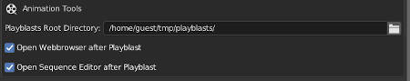

# blender-kitsu
blender-kitsu is a Blender addon to interact with Kitsu from within Blender. It also has features that are not directly realted to Kitsu but support certain aspects of the Blender Studio Pipeline.

## Installation
Download or clone this repository.
In the root project folder you will find the 'blender_kitsu' folder. Place this folder in your Blender addons directory or create a sym link to it.

## How to get started
After installing you need to setup the addon preferences to fit your environment.
In order to be able to log in to Kitsu you need a server that runs the Kitsu production management suite.
Information on how to set up Kitsu can be found [here](https://zou.cg-wire.com/).

If Kitsu is up and running and you can succesfully log in via the web interface you have to setup the addon preferences.

> **_NOTE:_**  If you want to get started quickly you only need to setup: step1, step2

##### **Setup login data**

>**Host**: The webadress of your kitsu server (e.G https://kitsu.mydomain.com) 
**Email**: The email you use to log in to kitsu 
**Password**: The password you use to log in to kitsu 

Press the login button. If the login was succesfull, the next step is..

##### **Select active project from the dropdown menu and setup project settings**

>**Project Root Directory**: Path to the root of your project. Will later be used to configurate the addon on a per project basis 

##### **Setup animation tools**

>**Playblast Root Directory**: Path to a directory in which playblasts will be saved to 
**Open Webbrowser after Playblast**: Open default browser after playblast which points to shot on kitsu 

##### **Setup lookdev tools**

>**Render Presets Directory**: Path to a directory in which you can save .py files that will be displayed in render preset dropdown. More info in: How to use render presets. 

##### **Setup media search paths**

>**Path List**: List of paths to top level directorys. Only media that is a child (recursive) of one of these directories will be scanned for outdated media. 

##### **Setup Miscellaneous settings**

>**Thumbnail Directory**: Directory where thumbnails will be saved before uploading them to kitsu. Cannot be edited. 
**Sequence Editor Render Directory**: Directory where sequence editor renderings will be saved before uploading them to kitsu. Cannot be edited 
**Enable Debug Operators**: Enables extra debug operators in the sequence editors Kitsu tab. 
**Advanced Settings**: Advanced settings that changes how certain operators work. 

After setting up the addon preferences you can make use of all the features of blender-kitsu

## Features
blender-kitsu has many feature and in this documentation they are divided in different sections.

#### Sequence Editor
blender-kitsu sequence editor tools were constructed with the idea in mind to have a relationship between sequence strips and shots on Kitsu. This connection enables the exchange of metadata between the edit and the shots on Kitsu. Some examples are frame ranges of shots can be directly updated from the edit or thumbnails can be rendered and uploaded to Kitsu with a click of a button and many more which you will find out in this section:

##### Metastrips
Metastrips are regular Movie Strips that can be linked to a shot in kitsu. It is a good idea to create a seperate meta strip in a seperate channel that represents the shot. That gives you the freedom to assemble a shot out of multiple elements, like multiple storyboard pictures, and still have one metastrip that contains the full shot range.

###### Create a metastrip
1. Select a sequence strip for which you want to create a metastrip and execute the `Create Metastrip` operator.
This will import a metastrip.mp4 (1000 frame black video) file which is saved in the addons repository. The metastrip will be placed one channel above the selected strips. Make sure there is enough space otherwise the metastrip will not be created.

###### Initialize/Link a shot
1. Select a metastrip and open the `Kitsu` tab in the sidebar of the sequence editor. You will find multiple ways on how to initialize your strip.

2. Case A: Shot does **already exist** on Kitsu

    2.1 Execute the `Link Shot` operator and a pop up will appear that lets you select the sequence and the shot to link to

    2.2 Alternatively you can also link a shot by pasting the URL. (e.G: https://kitsu.yourdomain.com/productions/fc77c0b9-bb76-41c3-b843-c9b156f9b3ec/shots/e7e6be02-5574-4764-9077-965d57b1ec12)  

    

3. Case B: Shot **does not exist** on Kitsu yet

    3.1 Execute the `Initialize Shot` Operator.

    3.2 Link this strip to a sequence with the `Link Sequence` operator or create a new seuence with the `Submit New Sequence` operator.

    3.3 Type in the name of the new shot in the `Shot` field

    3.4 Execute the `Submit New Shot` operator in the `Push` Panel (Will warn you if the shot already exists on Kitsu)

>**Note**: Most of the operatos are selection sensitive. So you can do these operations for a batch of seqeuence strips. If you have nothing selected it will usually try to operate on all strips in the sequence editor.  

##### Metadata
If you select a single linked strip you will see a `Metadata` panel that shows you the information that is related to the sequence and shot the strip is linking to.

The frame range will be updated by using the Blender editing tools on the strip. (trimming, sliding, etc.).  
If you execute the `Initialize Shot Start Frame` operator (refresh icon) the current in point of the strip will be remapped so the shot starts at 101 in the current editing state.  
You can reassing the shot to another seqeunce by exeucting the `Link Sequence` Operator, change the shot name or the seqeuence color. All this information and more can be `pushed` to kitsu which bring us to the next panel.  

##### Push

In the `Push` panel you will find all the operators that push data to Kitsu.  

>**Metadata**: Pushes metadata of shot: sequence, shotname, frame range, sequence_color
>>**Note**:  Global edit frame range will be saved in `"frame_in"` `"frame_out"` kitsu shot attribute  
The actual shot frame range (starting at 101) will be saved in `["data"]["3d_in"] and `["data"]["3d_out"] kitsu shot attribute  

>**Thumbnail**: Renders a thumbnail of the selected shots (will be saved to the `Thumbnail Directory` -> see addon preferences) and uploads it to Kitsu. Thumbnails are linked to a task in Kitsu. So you can select the Task Type for which you want to upload the thumbnail with the `Set Thumbnail Task Type` operator.  
If you select multiple metastrips it will always use the middle frame to create the thumbnail. If you have only one selected it will use the frame which is under the cursor (it curser is inside shot range).  
**Render**: Renders the shot range out of the sequence editor, saves it to disk and uploads it to Kitsu. Works very similar to the `Push Thumbnail` operator.

##### Pull
In the `Pull` panel you will find all the operators that pull data from Kitsu to a metastrip.  

>**Metadata**: Pulls metadata of shot: sequence, shotname, shot description and updates the strip name to match the shotname.
>>**Note**:  Frame ranges will **never** be updated when pulling data from Kitsu. They belong to the edit and will only be pushed to Kitsu. 

##### Multi Edit

The `Multi Edit` panel only appears when you select multiple metastrips that are all `initialized` but not `linked` yet.  

It is meant to be way to quickly setup lots of shots if they don't exist on Kitsu yet. You specify the sequence all shots should belong to and adjust the `Shot Counter Start` value. In the preview property you can see how all shots will be named when you execute the `Multi Edit Strip` operator. </b3>

###### Advanced Settings
If you check the `Advanced` checkbox next to the counter value, you have access to advance settings to customize the operator even more.

You can adjust the number of counter digits, the incrementation size and also the `Pattern` it will use to generate the shot name.  
>**Pattern**: supports 3 wildcards. `<Sequence>`, `<Counter>`, `<Project>` that can be used multiple times in any order.  
**Custom Sequence Variable**: specify a custom string that should be used in the `<Sequence>` wildcard instaed of the sequence name.  
**Custom Project Variable**: specify a custom string that should be used in the `<Project>` wildcard instaed of the project name.  

## Troubleshoot
blender-kitsu makes good use of logging and status reports. Most of the operators report information in the blender info bar. More detailed logs can be found in the blender system console. If you feel like anything went wrong, consider opening a console and check the logs.

## Plugins
---
This project uses gazu as a submodule to interact with the gazu data base.
- gazu doc : https://gazu.cg-wire.com/
- dazu repo: https://github.com/cgwire/gazu

## Development
---
In the project root you will find a `pyproject.toml` and `peotry.lock` file.
With `poetry` you can easily generate a virtual env for the project which should get you setup quickly.
Basic Usage: https://python-poetry.org/docs/basic-usage/

Create a sym link in your blender addons directory to the blender_kitsu folder.
