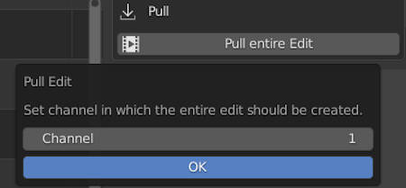
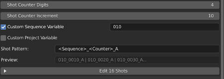
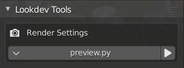
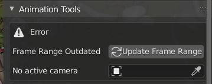

# blender-kitsu
blender-kitsu is a Blender addon to interact with Kitsu from within Blender. It also has features that are not directly realted to Kitsu but support certain aspects of the Blender Studio Pipeline.

## Table of Contents
- [Installation](#installation)
- [How to get started](#how-to-get-started)
    - [Setup login data](#setup-login-data)
    - [Setup Project Settings](#setup-project-settings)
    - [Setup Animation Tools](#setup-animation-tools)
    - [Setup Lookdev Tools](#setup-lookdev-tools)
    - [Setup Media Search Paths](#setup-media-search-paths)
    - [Setup Miscellaneous](#setup-miscellaneous)
- [Features](#features)
    - [Sequence Editor](#sequence-editor)
        - [Metastrips](#metastrips)
        - [Create a Metastrip](#create-a-metastrip)
        - [Initialize a Shot](#initialize-a-shot)
        - [Metadata](#metadata)
        - [Push](#push)
        - [Pull](#pull)
        - [Multi Edit](#multi-edit)
            - [Advanced](#advanced-settings)
        - [General Sequence Editor Tools](#general-sequence-editor-tools)
    - [Context](#context)
        - [Animation Tools](#animation-tools)
        - [Lookdev Tools](#lookdev-tools)
        - [Error System](#error-system)
- [Troubleshoot](#troubleshoot)
- [Credits](#credits)
- [Development](#development)

## Installation
Download or clone this repository.
In the root project folder you will find the 'blender_kitsu' folder. Place this folder in your Blender addons directory or create a sym link to it.

## How to get started
After installing you need to setup the addon preferences to fit your environment.
In order to be able to log in to Kitsu you need a server that runs the Kitsu production management suite.
Information on how to set up Kitsu can be found [here](https://zou.cg-wire.com/).

If Kitsu is up and running and you can succesfully log in via the web interface you have to setup the `addon preferences`.

> **_NOTE:_**  If you want to get started quickly you only need to setup login data and active project

###### **Setup Login Data**

>**Host**: The webadress of your kitsu server (e.G https://kitsu.mydomain.com) 
**Email**: The email you use to log in to kitsu 
**Password**: The password you use to log in to kitsu 

Press the login button. If the login was succesfull, the next step is..

###### **Setup Project Settings**

>**Project Root Directory**: Path to the root of your project. Will later be used to configurate the addon on a per project basis 

###### **Setup Animation Tools**

>**Playblast Root Directory**: Path to a directory in which playblasts will be saved to 
**Open Webbrowser after Playblast**: Open default browser after playblast which points to shot on kitsu 
**Open Video Sequence Editor after Playblast**: Open a new scene with Sequence Editor and playback playblast after playblast creation 

###### **Setup Lookdev Tools**

>**Render Presets Directory**: Path to a directory in which you can save .py files that will be displayed in render preset dropdown. More info in: How to use render presets. 

###### **Setup Media Search Paths**

>**Path List**: List of paths to top level directorys. Only media that is a child (recursive) of one of these directories will be scanned for outdated media. 

###### **Setup Miscellaneous**

>**Thumbnail Directory**: Directory where thumbnails will be saved before uploading them to kitsu. Cannot be edited. 
**Sequence Editor Render Directory**: Directory where sequence editor renderings will be saved before uploading them to kitsu. Cannot be edited 
**Enable Debug Operators**: Enables extra debug operators in the sequence editors Kitsu tab. 
**Advanced Settings**: Advanced settings that changes how certain operators work. 

After setting up the addon preferences you can make use of all the features of blender-kitsu

## Features
blender-kitsu has many feature and in this documentation they are divided in different sections.

#### Sequence Editor
---
blender-kitsu sequence editor tools were constructed with the idea in mind to have a relationship between sequence strips and shots on Kitsu. This connection enables the exchange of metadata between the edit and the shots on Kitsu. Some examples are frame ranges of shots can be directly updated from the edit or thumbnails can be rendered and uploaded to Kitsu with a click of a button and many more which you will find out in this section:

##### Metastrips
Metastrips are regular Movie Strips that can be linked to a shot in kitsu. It is a good idea to create a seperate meta strip in a seperate channel that represents the shot. That gives you the freedom to assemble a shot out of multiple elements, like multiple storyboard pictures, and still have one metastrip that contains the full shot range.

>**Good to know**: A metastrip can have 3 states. It can be **initialized** but **not** linked yet. That means the movie strips knows I am a metastrip but I don't have a relationship to a shot on Kitsu yet. It can be **linked**, which means the strip is already initialized and is linked to a sequence_id and shot_id on Kitsu. Only if a strip is linked you can exchange metadata, push thumbnails etc. The last state is **uninitialized** which basically means it's a regular movie strips and has nothing to do with kitsu.

###### Create a Metastrip
1. Select a sequence strip for which you want to create a metastrip and execute the `Create Metastrip` operator.
This will import a metastrip.mp4 (1000 frame black video) file which is saved in the addons repository. The metastrip will be placed one channel above the selected strips. Make sure there is enough space otherwise the metastrip will not be created.

###### Initialize a Shot
1. Select a metastrip and open the `Kitsu` tab in the sidebar of the sequence editor. You will find multiple ways on how to initialize your strip.

2. Case A: Shot does **already exist** on Kitsu

    2.1 Execute the `Link Shot` operator and a pop up will appear that lets you select the sequence and the shot to link to

    2.2 Alternatively you can also link a shot by pasting the URL. (e.G: https://kitsu.yourdomain.com/productions/fc77c0b9-bb76-41c3-b843-c9b156f9b3ec/shots/e7e6be02-5574-4764-9077-965d57b1ec12)  

    

3. Case B: Shot **does not exist** on Kitsu yet

    3.1 Execute the `Initialize Shot` Operator.

    3.2 Link this strip to a sequence with the `Link Sequence` operator or create a new seuence with the `Submit New Sequence` operator.

    3.3 Type in the name of the new shot in the `Shot` field

    3.4 Execute the `Submit New Shot` operator in the `Push` Panel (Will warn you if the shot already exists on Kitsu)

>**Note**: Most of the operatos are selection sensitive. So you can do these operations for a batch of seqeuence strips. If you have nothing selected it will usually try to operate on all strips in the sequence editor.  

##### Metadata
If you select a single linked strip you will see a `Metadata` panel that shows you the information that is related to the sequence and shot the strip is linking to.

The frame range will be updated by using the Blender editing tools on the strip. (trimming, sliding, etc.).  
If you execute the `Initialize Shot Start Frame` operator (refresh icon) the current in point of the strip will be remapped so the shot starts at 101 in the current editing state.  
You can reassign the shot to another seqeunce by exeucting the `Link Sequence` Operator, change the shot name or the seqeuence color.  

If you linked in a sequence that has no `["data"]["color"]` attribute on Kitsu yet the gpu overlay line will be white. In order to add a new sequence color execute the `Add Sequence Color` operator.  

All this information and more can be `pushed` to kitsu which bring us to the next panel.  

##### Push

In the `Push` panel you will find all the operators that push data to Kitsu.  

>**Metadata**: Pushes metadata of shot: sequence, shotname, frame range, sequence_color
>>**Note**:  Global edit frame range will be saved in `"frame_in"` `"frame_out"` kitsu shot attribute  
The actual shot frame range (starting at 101) will be saved in `["data"]["3d_in"] and `["data"]["3d_out"] kitsu shot attribute  

>**Thumbnails**: Renders a thumbnail of the selected shots (will be saved to the `Thumbnail Directory` -> see addon preferences) and uploads it to Kitsu. Thumbnails are linked to a task in Kitsu. So you can select the Task Type for which you want to upload the thumbnail with the `Set Thumbnail Task Type` operator.  
If you select multiple metastrips it will always use the middle frame to create the thumbnail. If you have only one selected it will use the frame which is under the cursor (it curser is inside shot range).  
**Render**: Renders the shot range out of the sequence editor, saves it to disk and uploads it to Kitsu. Works very similar to the `Push Thumbnail` operator.

##### Pull
In the `Pull` panel you will find all the operators that pull data from Kitsu to a metastrip.  

>**Metadata**: Pulls metadata of shot: sequence, shotname, shot description and updates the strip name to match the shotname.
>>**Note**:  Frame ranges will **never** be updated when pulling data from Kitsu. They belong to the edit and will only be pushed to Kitsu. 

If you have not sequence selected the `Pull Entire Edit` Operator will appear in the `Pull` panel. 

After you selected the channel it will go through all shots on Kitsu, create a metastrip which will be linked to the respective shot and pulls all metadata.  
It will use te `frame_in` and `frame_out` attribute on Kitsu to determine the in and out points in the edit. So make sure these are up to date and don't overlap.  

As a result a bigger edit with nice sequence_colors can look pretty cool:

##### Multi Edit

The `Multi Edit` panel only appears when you select multiple metastrips that are all `initialized` but not `linked` yet.  

It is meant to be way to quickly setup lots of shots if they don't exist on Kitsu yet. You specify the sequence all shots should belong to and adjust the `Shot Counter Start` value. In the preview property you can see how all shots will be named when you execute the `Multi Edit Strip` operator. </b3>

###### Advanced Settings
If you check the `Advanced` checkbox next to the counter value, you have access to advance settings to customize the operator even more.

You can adjust the number of counter digits, the incrementation size and also the `Pattern` it will use to generate the shot name.  
>**Pattern**: supports 3 wildcards. `<Sequence>`, `<Counter>`, `<Project>` that can be used multiple times in any order.  
**Custom Sequence Variable**: specify a custom string that should be used in the `<Sequence>` wildcard instaed of the sequence name.  
**Custom Project Variable**: specify a custom string that should be used in the `<Project>` wildcard instaed of the project name.  

##### General Sequence Editor Tools
In the general tab you can find some tools that don't directly relate to Kitsu but are useful for editing.

`Scan for outdated media` will scan the selected / all sequence strips for their source media file. It searches for a later version in the same directory as the source media. If the current media file is outdated it will highlight that strip with a red line in the sequence editor:

To update the outdated strips you can select them individually and by clicking the `Arrow Up` or `Arrow Down` you cycle through the available versions on disk. You will be prompted with an information if you reached the latest or oldest version.

>**Note**: The operator searches for a version string e.G `v001` and checks files that are named the same but have a different version.  

#### Context
---
blender-kitsu context features were constructed with the idea in mind to create a relationship between a certain task on Kitsu and a blend file.  

To create 'context' you can find the `Context Browser` in the `Kitsu` panel in the sidebar of the 3D Viewport.  

By selecting the different drop down menus you can browse through the Kitsu file structure and set e.G the active sequence, active shot and task type you want to work on.  

The `Detect Context` operator tries to look at the filepath of the blend file and figure out the context automatically.  

Depending on which `Task Type` you select different tool sets will be available.

##### Animation Tools

The animation tools will show up when you selected a `Task Type` with the name `Animation`.  

>**Create Playblast**: Will create a openGL viewport render of the viewport from which the operator was executed and uploads it to Kitsu. The `+` button increments the version of the playblast. If you would override an older version you will see a warning before the filepath. The `directory` button will open a file browser in the playblast directory. The playblast will be uploaded to the `Animation` Task Type of the active shot that was set in the `Context Browser`. The webbrowser will be opened after the playblast and should point to the respective shot on Kitsu.  
**Update Frame Range**: Will pull the frame range of the active shot from Kitsu and apply it to the scene. It will use the `['data']['3d_in']` and `['data']['3d_out']` attribute of the Kitsu shot.  
**Update Output Collection**: Blender Studio Pipeline specific operator.  
**Duplicate Collection**: Blender Studio Pipeline specific operator.  
**Check Action Names**: Blender Studio Pipeline specific operator.  

##### Lookdev Tools
The lookdev tools will show up when you selected a `Task Type` with the name `Lighting` | `Rendering` | `Compositing`.  

>**Apply Render Preset**: Consists of a dropdown menu that displays all `.py` files which are present in the `Render Presets Directory` (defined in the addon preferences). Select the `.py` file you want to execute. When you hit the `Play` button the `main()` function of the python file will be executed. Very useful to quickly switch between different render settings.

##### Error System

blender-kitsu has different checks that are performed during file load or during editing. If it detects an error that prevents other operators to run it will display an error in the ui.  

## Troubleshoot
blender-kitsu makes good use of logging and status reports. Most of the operators report information in the blender info bar. More detailed logs can be found in the blender system console. If you feel like anything went wrong, consider opening a console and check the logs.

## Credits
This project uses gazu as a submodule to interact with the gazu data base. Gazu is written by CG Wire, a company based in France.
- dazu repo: https://github.com/cgwire/gazu
- gazu doc : https://gazu.cg-wire.com/

The file at ./blender_kitsu/sqe/draw.py is copied and modified from the blender-cloud-addon (https://developer.blender.org/diffusion/BCA/).
Original author of this file is: Sybren A. Stuevel.

## Development
In the project root you will find a `pyproject.toml` and `peotry.lock` file.
With `poetry` you can easily generate a virtual env for the project which should get you setup quickly.
Basic Usage: https://python-poetry.org/docs/basic-usage/

Create a sym link in your blender addons directory to the blender_kitsu folder.
