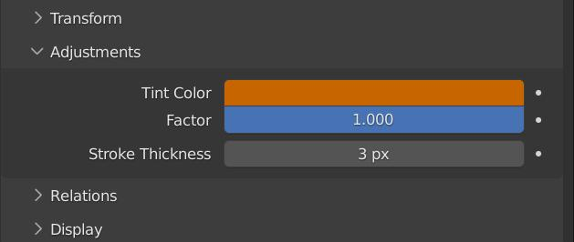

# grease-converter
grease-converter is a Blender Add-on that can convert annotations to grease pencil objects and vise versa.

## Installation
Download or clone this repository.
In the root project folder you will find the 'grease_converter' folder. Place this folder in your Blender addons directory or create a symlink to it.

## How to get started
After the add-on is installed you have 2 new operators available.

- **grease_converter.convert_to_grease_pencil**:
    - Located in the 3DView Side Panel (N)-> View -> Annotations Panel
    - Converts active annotation to Grease Pencil Object and link it in the active Scene.
    - 

- **grease_converter.convert_to_annotation**:
    - Located in the 3DView Header -> Object -> Convert
    - Active objects needs to be grease pencil object. Will convert it to Annotation Grease Pencil Object. Uses Tint Color and Stroke Thickness attribute found in the Adjustments Panel for final annotation color and stroke thickness. (Annotations are a simple version of GreasePencil and only support **one* color and stoke thickness per layer)
    - 

## Development
In the project root you will find a `pyproject.toml` and `peotry.lock` file.
With `poetry` you can easily generate a virtual env for the project which should get you setup quickly.
Basic Usage: https://python-poetry.org/docs/basic-usage/
