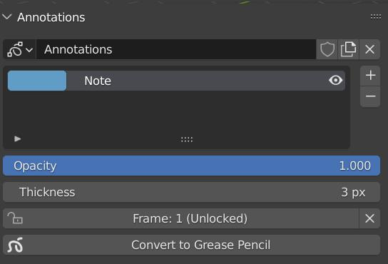

# Grease Pencil Converter
grease-converter is a Blender Add-on that can convert annotations to grease pencil objects and vise versa.

## Table of Contents

- [Installation](#installation)
- [How to get Started](#how-to-get-started)

## Installation
1. Clone repository `git clone https://projects.blender.org/studio/blender-studio-pipeline.git`
2. From the root of the repository navigate to `/scripts-blender/addons/` 
3. Find the the `grease_converter` folder. Place this folder in your Blender addons directory or create a symlink to it.

## How to get started
After the add-on is installed you have 2 new operators available.

- **grease_converter.convert_to_grease_pencil**:
    - Located in the 3DView Side Panel (N)-> View -> Annotations Panel
    - Converts active annotation to Grease Pencil Object and link it in the active Scene.
    - 
    

- **grease_converter.convert_to_annotation**:
    - Located in the 3DView Header -> Object -> Convert
    - Active objects needs to be grease pencil object. Will convert it to Annotation Grease Pencil Object. Uses Tint Color and Stroke Thickness attribute found in the Adjustments Panel for final annotation color and stroke thickness. (Annotations are a simple version of GreasePencil and only support **one* color and stoke thickness per layer)
    
    
    - >**Note**: If the grease pencil object has it's transforms not applied or a parent you will be prompted with a warning as these are not taken in to account yet
